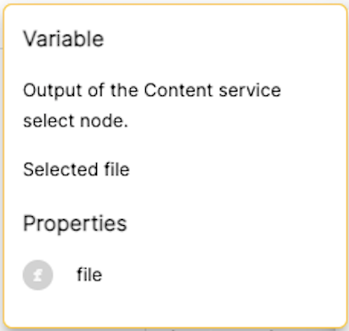

# Implicit mapping in process variables

- [Intro](#intro)
- [The `ProcessEditorElementVariablesService`](#the-service-that-retrieves-the-variables-for-a-task)
- [The `ProcessEditorElementVariablesProvider` interface](#the-variable-providers-interface)
- [Creating a new variable provider](#creating-a-new-variable-provider)

## Intro

In the process editor, there are different options when mapping the inputs and outputs of a task. 

The `Map variables` option is an explicit mapping where the user needs to set which parameter value is going to be assigned from/to a variable (input/output mapping), but the rest of the options are implicit, so the only thing we can do for knowing which variables are available for a task that is after another with an implicit mapping, is inspecting its previous tasks to retrieve them. 

The service in charge of retrieving the variables available in a process definition for a shape is the [`ProcessEditorElementVariablesService` service](../process-editor-element-variables.service.ts).

Another problem here was how to know which are the outputs of a task because it depends on the concrete implementation of that task, so we provided a mechanism in the Modeling Application for getting the inputs and outputs of a task based on its implementation.

This means that we need to implement the [`ProcessEditorElementVariablesProvider` interface](../process-editor-element-variables-provider.service.ts) for the different kinds of tasks that can provide outputs (user task, service task, called element, participant,...) and inject them in the Modeling Application for the [`ProcessEditorElementVariablesService` service](../process-editor-element-variables.service.ts) to retrieve the available variables for a certain task.

As a result, when we try to map available variables to an input, the Modeling Application can show those variables that have been implicitly mapped to the process and some information about them (such as which task the variable belongs to, the type, a description if available,...)

>

## The service that retrieves the variables for a task

The [`ProcessEditorElementVariablesService` service](../process-editor-element-variables.service.ts) is responsible for navigating back in a process from the selected task to the start event, collecting all the variables that those tasks preceding the selected one map as outputs.

The service receives the set of services that can provide variables for a BPMN element by using the [`PROCESS_EDITOR_ELEMENT_VARIABLES_PROVIDERS` injection token](../process-editor-element-variables-provider.service.ts) so when it navigates back through the process, it uses the proper variable provider registered in this token for the BPMN element type.

It also provides a couple of public methods for adding information to the variables returned by the variable providers, so when the Modeling Application can display the available variables it includes information such as where the variable is coming from and a tooltip with information:
* `getVariableTooltip(variable: ElementVariable, source: any, headerText = 'SDK.CONDITION.TOOLTIP.VARIABLE'): string`: It creates an HTML string containing the information about the variable. It is usually displayed by using the [`adf-tooltip-card` directive](https://github.com/Alfresco/alfresco-ng2-components/blob/6f209726e9a19f69115c07a6aadd764f63dce09b/lib/core/src/lib/directives/tooltip-card/tooltip-card.directive.ts#L22) that allows displaying HTML content as an overflow panel.

>

* `patchSourceIconAndTooltip(element: Bpmn.DiagramElement, variables: ElementVariable[]): ProcessEditorElementVariable`: For an array of variables, creates the additional information like the tasks they belong to, the icon for each variable based on its [primitive type](../../helpers/primitive-types.ts) and the tooltip (calling the method described before).

>

## The variable provider's interface

This is the interface a variable provider must implement to provide the [`ProcessEditorElementVariablesService` service](../process-editor-element-variables.service.ts) with the variables that concrete implementation of a task is mapping.

The [`ProcessEditorElementVariablesProvider` interface](../process-editor-element-variables-provider.service.ts) defines only three methods:
* `getHandledTypes(): ProcessEditorElementWithVariables[];`: An array of which [BPMN elements](../../api/types.ts#694) manages this variables provider
* `getOutputVariables(element: Bpmn.DiagramElement): Observable<ElementVariable[]>;`: Return the array of output variables for a BPMN element
* `getInputVariables(element: Bpmn.DiagramElement): Observable<ElementVariable[]>;`: Return the array of input variables for a BPMN element

For example, the [`ProcessElementVariablesProviderService` service](../../../../../../process-editor/src/services/process-element-variables-provider.service.ts) is an implementation that returns the process variables defined for the process.

Some variable providers are registered in the [`ProcessEditorModule` module](../../../../../../process-editor/src/process-editor.module.ts) by using the [`provideProcessEditorElementVariablesProvider` function](../process-editor-element-variables-provider.service.ts):

```typescript
@NgModule({
    ...,
    providers: [
        ...,
        provideProcessEditorElementVariablesProvider(ProcessElementVariablesProviderService),
        provideProcessEditorElementVariablesProvider(CalledElementVariablesProviderService),
        provideProcessEditorElementVariablesProvider(ParticipantElementVariablesProviderService),
        ...
    ]
})
export class ProcessEditorModule { }
```

## Creating a new variable provider

In this example, let's say we want to create a variable provider for the service tasks. A service task is implemented as an action in a connector that must be present as a model inside our project, so we need to inspect the available connectors for the current project, get its actions and then we can decide which variables it can provide as inputs or outputs depending on the inputs and outputs of the action.

The service task sets the implementation from a connector with the following pattern. `<connector_name>.<action>` so we can split the BPMN element implementation attribute by `.` and get the connector name and the action to inspect its inputs and outputs.

```typescript
@Injectable({
    providedIn: 'root'
})
export class ConnectorElementVariablesProviderService implements ProcessEditorElementVariablesProvider {

    constructor(private store: Store<AmaState>) { }

    // The provider will be used only when the BPMN element is a service task
    getHandledTypes(): ProcessEditorElementWithVariables[] {
        return [ProcessEditorElementWithVariables.ServiceTask];
    }

    getOutputVariables(element: Bpmn.DiagramElement): Observable<ElementVariable[]> {
        return this.getConnectorVariablesFromElement(element, 'outputs');
    }

    getInputVariables(element: Bpmn.DiagramElement): Observable<ElementVariable[]> {
        return this.getConnectorVariablesFromElement(element, 'inputs');
    }

    private getConnectorVariablesFromElement(element: Bpmn.DiagramElement, type: 'inputs' | 'outputs'): Observable<ElementVariable[]> {
        if (!element.businessObject[BpmnProperty.implementation]) {
            return of([]);
        }
        // The implementation looks like <connector_name>.<action>
        const parts = element.businessObject[BpmnProperty.implementation].split('.');
        const connectorName = parts[0];
        const connectorAction = parts[1];

        return this.store.select(selectSelectedProjectId)
            .pipe(
                switchMap(projectId => this.store.select(projectConnectorByName(projectId, connectorName))),
                filter(connector => !!connector),
                // update the connectors in the store from the backend
                tap(connector => this.store.dispatch(new GetConnectorAttemptAction(connector.id))),
                switchMap(connector => zip(of(connector), this.store.select(connectorContentById(connector.id)))),
                filter(([, content]) => !!content),
                take(1)
            ).pipe(
                map(([, content]) => {
                    let vars: ConnectorParameter[] = [];
                    if (content && content.actions) {
                        const actionId = Object.keys(content.actions).find(key => content.actions[key].name === connectorAction);
                        const action = content.actions[actionId];
                        if (action && action[type]) {
                            vars = action[type];
                        }
                    }
                    return vars;
                })
            );
    }
}
```

And now all we need to do is register the provider in one of the application modules:

```typescript
@NgModule({
    .,
    providers: [
        ...,
        provideProcessEditorElementVariablesProvider(ConnectorElementVariablesProviderService),
        ...
    ],
    ...
})
export class MyBusinessExampleModule { }
```
