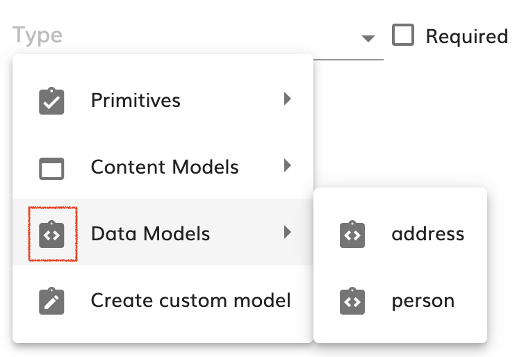
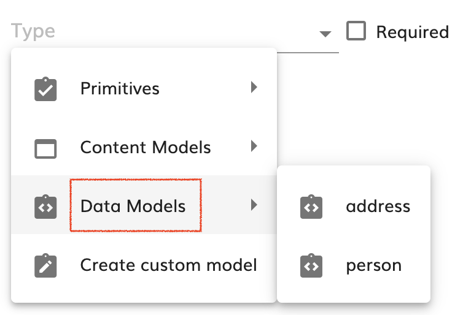

# Working with JSON Schemas

- [Intro](#intro)
- [The Project JSON Schema Registry](#the-project-json-schema-registry)
  * [Primitive types](#primitive-types)
  * [Registering a primitive type and an input for it](#registering-a-primitive-type-and-an-input-for-it)
  * [Registering a JSON Schema provider](#registering-a-json-schema-provider)
- [Referencing JSON Schemas in the Registry](#referencing-json-schemas-in-the-registry)
- [Working with registered JSON Schemas](#working-with-registered-json-schemas)

## Intro

The modeling application uses JSON schema to define data structures for example in variables, connector inputs or events.

The advantage of having those data structures defined using this standard is that the application knows the properties inside complex objects and it can provide proper [user inputs](../../variables/properties-viewer/value-type-inputs/doc/README.md) for the data or [autocompletion](../../variables/expression-code-editor/doc/README.md).

In this document, we are going to explain how those data structure definitions can be registered in the modeling application at the project level, and how we can use those definitions.

## The Project JSON Schema Registry

The registry of all the available JSON schemas is paced inside the [CodeEditorService](../../code-editor/services/code-editor-service.service.ts) in order to be available in all the code editors used around the modeling application.

But the service in charge of managing the JSON schemas is the [ModelingJSONSchemaService](../modeling-json-schema.service.ts). It registers/modifies the project JSON schemas every time a [JSON schema provider](#registering-a-json-schema-provider) communicates changes in the schemas it provides. To do so, it subscribes to all the available provider's changes observables like this:

```typescript
this.providers.filter(provider => !provider.isGlobalProvider()).forEach(provider => {
    provider.modelingJsonSchemasUpdated$.subscribe(modelingJsonSchemas => {
        if (modelingJsonSchemas && modelingJsonSchemas.length > 0) {
            modelingJsonSchemas.forEach(modelingJsonSchema => {
                this.registerTypeModel(modelingJsonSchema.typeId, modelingJsonSchema.schema, modelingJsonSchema.projectId);
            });
        }
        this.schemasChanged.next(modelingJsonSchemas);
    });
});
```

The [ModelingJSONSchemaService](../modeling-json-schema.service.ts) propagates the changes that occur in any of the registered schemas in its `schemasChanged$: Observable<ModelingJsonSchema[]>` observable so other services can be notified of the changes.

### Primitive types

There are also some types that are global and that are called [Primitive Types](../../helpers/primitive-types.ts). These types can be simple types like `string` or `integer` but they can be also complex types like `file` or `folder` that are not project specific but application specific. These types are also registered in the JSON schema registry, but they are read only once instead of being subscribed to changes:

```typescript
this.providers.filter(provider => provider.isGlobalProvider()).forEach(provider => {
    provider.initializeModelingJsonSchemasForProject(null).pipe(take(1)).subscribe(jsonSchemas => {
        jsonSchemas.forEach(jsonSchema => this.registerGlobalTypeModel(jsonSchema.typeId, jsonSchema.schema));
        this.schemasChanged.next(jsonSchemas);
    });
});
```

The path under the _Primitive Types_ is registered in order to be referenced (see [how to work with references](#referencing-json-schemas-in-the-registry) later), is slightly different from regular references, they are registered under the `#/defs/primitive` path.

This is because the JSON schema provider for the _Primitive Types_ implemented in the [RegisteredInputsModelingJsonSchemaProvider](../registered-inputs-modeling-json-schema-provider.service.ts) service is returning `true` for the method `isGlobalProvider()` (the default implementation is returning `false`). Any JSON schema provider implemented as a global provider will register its types under the `#/defs/primitive` path.

### Registering a primitive type and an input for it

If at some point we need to add a type that is not project specific but global for the modeling application, we can do it by completing the three steps described here. For demonstration purposes, let's say we want to register the `floating-point` primitive.

The first thing to do is to add the new type to the the `primitive_types` array [here](../../helpers/primitive-types.ts#18) so it looks like this:

```typescript
export const primitive_types: string[] = [
    'string',
    'integer',
    'boolean',
    'date',
    'datetime',
    'file',
    'json',
    'folder',
    'array',
    'floating-point'
];
```

Secondly, we can create an input for the `floating-point` primitive so that when the user is prompted for a floating point anywhere in the application, we can display a proper input. You can see more details on the [inputs documentation](../../variables/properties-viewer/value-type-inputs/doc/README.md) but here is a simple code snippet:

```typescript
import { Component, Input } from '@angular/core';
import { VariablesService } from '../../variables/variables.service';
import { PropertiesViewerModelValidatedInputComponent } from '../../variables/properties-viewer/model-validated-input.component';

@Component({
    template: `
    <mat-form-field floatLabel="never">
        <input
            matInput
            type="number"
            [step]="step"
            [placeholder]="(placeholder ? placeholder : 'SDK.VALUE') | translate"
            [modelingsdk-allowed-characters]="regexInput"
            data-automation-id="variable-value"
            [formControl]="validatedInput"
            [errorStateMatcher]="matcher"
        />
        <mat-hint modelingsdk-input-error class="mat-error"></mat-hint>
    </mat-form-field>
    `
})
export class PropertiesViewerFloatingPointInputComponent extends PropertiesViewerModelValidatedInputComponent {

    @Input() step: number = null;
    regexInput = /^[+-]?\d+(\.\d+)?$/;

    constructor(variablesService: VariablesService) {
        super(variablesService);
    }

    protected computeModel() {
        if (this.model?.multipleOf) {
            this.step = this.model.multipleOf;
        }
    }

    protected transformValueToBeEmitted(value: any) {
        const inputValue = parseFloat(value);
        return isNaN(inputValue) ? null : inputValue;
    }
}
```

And finally let's register the input inside a module. By registering the input, it is added to the [INPUT_TYPE_ITEM_HANDLER](../../variables/properties-viewer/value-type-inputs/value-type-inputs.ts#22) and this injection token is used by the [RegisteredInputsModelingJsonSchemaProvider](../registered-inputs-modeling-json-schema-provider.service.ts) service to register the schema globally.

For registering the input along with the JSON schema associated to the `floating-point` primitive let's add it to any application module:

```typescript
@NgModule({
    imports: [
        ...,
        VariablesModule
    ],
    providers: [
        ...,
        provideInputTypeItemHandler('floating-point', PropertiesViewerFloatingPointInputComponent, 'json', { title: 'Floating point', type: 'number', multipleOf: 0.01 })
    ],
    ...
})
export class MyBusinessExampleModule { }
```

### Registering a JSON Schema provider

We can register a schemas provider in order to register at project scope some JSON schemas that can be referenced in other places of the application to compose new JSON Schemas or as process types. For illustrating this example, let's say we want to register some schemas that are coming from an external service via REST API and we have a client class for that service called `MySchemaServiceClient` registered at root scope.

In order to create the provider, we must extend the abstract class [ModelingJsonSchemaProvider<T>](../modeling-json-schema-provider.service.ts#36). Mainly the methods that we have to implement are:

* `abstract getProviderName(): string;` Providing an unique name for the provider
* `abstract getProviderIcon(): string;` An material design icon id to be displayed along with the provider name when, for example, selecting a variable type

> 

* `abstract getProviderTranslatedName(): string;` Returns the name of the provider for the current locale.

> 

* `protected abstract retrieveModels(projectId: string): Observable<ModelsWithJsonSchemaMap<T>>;` This methods retrieves the items that would be registered as JSON Schemas (after transforming the `T` object into a list of JSON schemas)
* `protected abstract transformModelToJsonSchemas(projectId: string, modelId: string, modelContent: T): ModelingJsonSchema[];` Transform one item ot `T` class into a set of JSON schemas
* `public abstract getPropertyTypeItems(projectId: string): Observable<PropertyTypeItem>;` Creates a [`PropertyTypeItem`](../../variables/properties-viewer/property-type-item/models.ts#20) hierarchical object with the available schemas to be injected in the variables type selector

Let's implement the abstract methods for our new provider:

```typescript
export interface MyExternalServiceResponse {
    id: string;
    name: string;
    description?: string;
    model: JSONSchemaInfoBasics;
}


export class MyExternalServiceJsonSchemaProviderService extends ModelingJsonSchemaProvider<MyExternalServiceResponse> {

    constructor(private client: MySchemaServiceClient, private translationService: TranslationService) {
        super();
    }

    private externalServiceSchemas: MyExternalServiceResponse[] = [];

    getProviderName(): string {
        return 'my-external-service';
    }

    getProviderIcon(): string {
        return 'api';
    }

    getProviderTranslatedName(): string {
        return this.translationService.instant('MY_BUSINESS.MY_EXTERNAL_SERVICE');
    }

    protected retrieveModels(projectId: string): Observable<ModelsWithJsonSchemaMap<MyExternalServiceResponse>> {
        return this.client.getModels().pipe(
            take(1),
            map((externalModels: MyExternalServiceResponse[]) => {
                this.externalServiceSchemas = externalModels || [];
                const result: ModelsWithJsonSchemaMap<MyExternalServiceResponse> = {};
                this.externalServiceSchemas.forEach(model => result[model.id] = model);
                return result;
            });
        );
    }

    protected transformModelToJsonSchemas(projectId: string, modelId: string, schema: MyExternalServiceResponse): ModelingJsonSchema[] {
        return [{
            projectId,
            schema: schema.model,
            typeId: [this.getProviderName(), modelId]
        }];
    }

    getPropertyTypeItems(projectId: string): Observable<PropertyTypeItem> {
        const rootItem: PropertyTypeItem = {
            displayName: this.getProviderTranslatedName(),
            iconName: this.getProviderIcon(),
            isCustomIcon: this.isCustomIcon(),
            provider: this.getProviderName()
        };

        rootItem.children = [];

        this.externalModels.forEach(externalModel => {
            if (rootItem.children) {
                rootItem.children.push({
                    displayName: externalModel.name,
                    iconName: this.getProviderIcon(),
                    isCustomIcon: this.isCustomIcon(),
                    provider: this.getProviderName(),
                    description: externalModel.description,
                    typeId: [this.getProviderName(), externalModel.id]
                });
            }
        });

        rootItem.children.sort(this.sort);
        return of(rootItem);
    }
}
```

For the provider to be available in the modeling application all we have to do is register it in some module like this:

```typescript
@NgModule({
    ...
    providers: [
        ...,
        provideModelingJsonSchemaProvider(MyExternalServiceJsonSchemaProviderService)
    ],
    ...
})
export class MyBusinessExampleModule { }
```

## Referencing JSON Schemas in the Registry

The [ModelingJSONSchemaService](../modeling-json-schema.service.ts) registers the schemas under a definitions path based on what the provider returns as `typeId` in the [ModelingJsonSchema](../modeling-json-schema.service.ts#24), so for example, if the [ModelingJsonSchema](../modeling-json-schema.service.ts#24) instance is:

```typescript
{
    projectId: 'example-project'
    typeId: ['example-provider', 'person'];
    schema: {
        type: 'object',
        properties: {
            age: {
                type:'integer'
            },
            name: {
                type: 'string'
            }
        }
    };
}
```

The path for referencing this schema from other schemas will be:

```text
#/$defs/example-provider/person
```

For making a reference to this schema for example in a variable we can use this reference as follows:

```typescript
const myPersonVar: EntityProperty = {
    id: 'myPersonVar-id',
    name: 'myPersonVar',
    label: 'My Person Variable',
    type: 'json',
    model: {
        $ref: '#/$defs/example-provider/person'
    }
}
```

## Working with registered JSON Schemas

Here we are going to list, just for reference some places that make use of the JSON schemas.

| Service/Component | Description |
| ----------------- | ----------- |
| [JSONSchemaToEntityPropertyService](../json-schema-to-entity-property.service.ts) | This service with its method `getEntityPropertiesFromJSONSchema` converts a given JSON schema into an [`EntityProperty`](../../api//types.ts#265) that is a variable representation |
| [ModelingTypesService](../../variables/expression-code-editor/services/modeling-types.service.ts)| This service makes use of the registered JSON schemas to help with autocompletion and hover providers in the [Expression Editor](../../variables/expression-code-editor/doc/README.md)|
| [PropertyTypeSelectorSmartComponent](../../variables/properties-viewer/property-type-selector/property-type-selector.smart-component.ts)| This component retrieves the [`PropertyTypeItem`](../../variables/properties-viewer/property-type-item/models.ts#20) to build a hierarchical selector of variable/parameter types |
|[MappingVariableExpressionDropdownComponent](../../components/variable-selectors/mapping-variable-expression-dropdown/mapping-variable-expression-dropdown.component.ts)| This component filters the variables that match a given input, so in order to know if a variable is assignable to the input, it looks for their models |
|[VariableSelectorDropdownComponent](../../components/variable-selectors/variable-selector-dropdown/variable-selector-dropdown.component.ts)| This component filters the variables that match a given input, so in order to know if a variable is assignable to the input, it looks for their models |
|[VariableSelectorComponent](../../components/variable-selectors/variable-selector/variable-selector.component.ts)| This component filters the variables that match a given input, so in order to know if a variable is assignable to the input, it looks for their models |
| [ProjectEffects](../../../../../../project-editor/src/lib/store/effects/project.effects.ts#114) | When opening a project, all the schemas available for that project are initialized |
