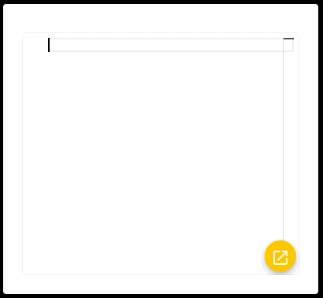
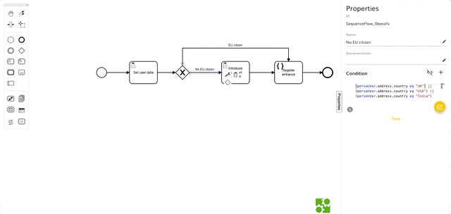
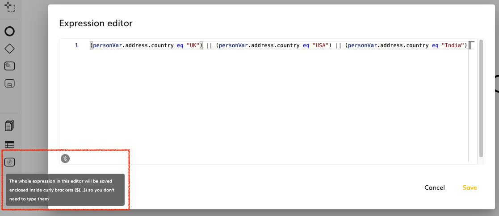
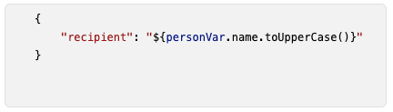

# Expression Editor

- [Intro](#intro)
- [Components](#components)
- [Using the Expression Editor](#using-the-expression-editor)
  * [Properties](#properties)
  * [Events](#events)
- [Creating a new expression syntax](#creating-a-new-expression-syntax)
  * [Add JEXL expression resolving support to the project](#add-jexl-expression-resolving-support-to-the-project)
  * [Add the JEXL expression syntax to the `ExpressionSyntax` enumeration](#add-the-jexl-expression-syntax-to-the-expressionsyntax-enumeration)
  * [Implement the `ExpressionSyntaxProvider` for JEXL](#implement-the-expressionsyntaxprovider-for-jexl)
  * [Register the expression syntax inside a module](#register-the-expression-syntax-inside-a-module)
  * [Use the JEXL language syntax in the Expression Editor](#use-the-jexl-language-syntax-in-the-expression-editor)

## Intro

The Expression Editor allows the user of the modeling application to create expressions based on an expression language (for example [JUEL](http://juel.sourceforge.net/)) providing colouring and autocompletion for variables, functions, and operators available in the context where the expression is going to be used.

We can register multiple expression language syntaxes, but the default one is JUEL.

It supports embedding the expressions in another host language (as for example JSON or HTML) colouring accordingly this host language.

> 

The Expression Editor is used in multiple views of the application and in many of them it is placed on a tiny section that sometimes, makes hard to build properly the text with the expression, that is why it provides a button to open the editor in a modal dialog that takes more space and facilitate the editing to the user.

When the modal dialog is displayed, then an expression simulator is also available so the user can provide values for the variables in the context of the expression so he/she can see the actual result of the expression that has been written.

> 

## Components

The Expression Editor is composed by 3 different components:

1. [modelingsdk-expression-code-editor](../components/expression-code-editor/expression-code-editor.component.ts): This is an instance of the [Monaco editor](https://microsoft.github.io/monaco-editor/) customized by receiving the context and the expression language syntax.

2. [modelingsdk-expression-code-editor-dialog](../components/expression-code-editor-dialog/expression-code-editor-dialog.component.ts): This is a modal dialog that contains an instance of the `modelingsdk-expression-code-editor` (but it has disabled the option to open the editor in a dialog) and an instance of the `modelingsdk-expression-simulator` component that can be toggled.

3. [modelingsdk-expression-simulator](../components/expression-simulator/expression-simulator.component.ts): This component allows the user to set values to the variables in the context of the expression and execute the expression in order to view the actual result.

## Using the Expression Editor

In order to use the expression editor, we must provide the variables that can be used in the context of the expression and the expression language syntax. We can also set a host language (for example HTML or JSON) in order to properly colourize the text according to that base language in addition to colourizing the expression itself.

> :warning: **NOTE**: For technical restrictions with the [current version of Monaco editor](https://www.npmjs.com/package/ngx-monaco-editor/v/8.1.1) used, for the base language to work properly,the first character of the text contained in the editor is not recognised so we recommend to start using a blank character, otherwise, we will see errors in the browser console regarding the token recognizer.

An example of how to include the Expression Editor in a template could be:

```html
<modelingsdk-expression-code-editor
    (expressionChange)="onExpressionChange($event)"
    [expression]="expressionValue"
    [variables]="variablesList"
    [expressionSyntax]="expressionSyntax"
    [language]="hostLanguage"
    >
</modelingsdk-expression-code-editor>
```

### Properties

| Name | Type | Default value | Description |
| ---- | ---- | ------------- | ----------- |
| expression | `string` | `''` | The string containing the expression to be edited |
| variables | [`EntityProperty`](../../../api/types.ts#265)`[]`| `[]` | An array of variables in the context of the expression that can be used |
| expressionSyntax | [`ExpressionSyntax`](../../../api/types.ts#729) | `ExpressionSyntax.JUEL` | The expression language syntax to be used when building the expression. |
| language | `string` | `null` | A string with the name of the host language in which the expression is going to be embedded. The possible values are those supported OOTB by the Monaco Editor (at this moment: `css`, `html`, `json` and `typescript`). More information [here](https://microsoft.github.io/monaco-editor/api/modules/monaco.languages.html) |
| removeEnclosingBrackets | `boolean` | `true`| There are some situations where the expression is not allowed to be embedded inside another string, so in that cases we don't want to force the user to write the container brackets (`${...}`). For those cases, set this parameter to `true` and an icon with information hint will be displayed at the bottom left corner of the editor |
| enableInlineEditor | `boolean` | `true` | This enables the expression edition. When set to false, instead of the Monaco editor, a static block is displayed colourizing its content according to the expression language syntax.  |
| enableDialogEditor | `boolean` | `true` | When `false` it hides the button to open the dialog `modelingsdk-expression-code-editor-dialog` |
| removeLineNumbers | `boolean` | `true` | Hides the line numbers in the monaco editor |
| lineWrapping | `boolean` | `true` | Prevents the text to overflow the editor width |
| nonBracketedOutput | `boolean` | `false` | When set to `true` the emitted expression in the `expressionChange` event will remove the enclosing brackets (`${...}`) before emitting so only the expression inside is emitted |
| dialogRemoveLineNumbers | `boolean` | `false` | Controls the `removeLineNumbers` in the `modelingsdk-expression-code-editor-dialog`. It only makes sense when `enableDialogEditor=true` |
| dialogLineWrapping | `boolean` | `false` | Controls the `lineWrapping` in the `modelingsdk-expression-code-editor-dialog`. It only makes sense when `enableDialogEditor=true` |

### Events

| Name | Type | Description |
| ---- | ---- | ----------- |
| expressionChange | [`EventEmitter`](https://angular.io/api/core/EventEmitter)`<string>` | Emits the string containing the expression when changed |

## Creating a new expression syntax

As mentioned before, we can set the expression language syntax to the Expression Editor, so in this section we are going to provide an example on how it could be done, for example, to support [JEXL](https://commons.apache.org/proper/commons-jexl/) (Java Expression Language).

### Add JEXL expression resolving support to the project

For this example, we are going to use a third party library such as [this](https://www.npmjs.com/package/jexl) to support resolving JEXL expressions, so in order to do that, we must execute in the console the following command to install the dependency

```
npm i jexl
```

### Add the JEXL expression syntax to the `ExpressionSyntax` enumeration

We must edit the [`ExpressionSyntax`](../../../api/types.ts#729) in order to include the new JEXL expression syntax:

```typescript
export enum ExpressionSyntax {
    JUEL= 'juel',
    NONE = 'none',
    JEXL = 'jexl'
}
```

### Implement the `ExpressionSyntaxProvider` for JEXL

We need to implement the [ExpressionSyntaxProvider](../services/expression-syntax.provider.ts#24) interface in order to provide the methods to initialize the editor tokenizer, provide hover cards and autocompletion, and to resolve the expressions in the simulator.

The implementation is very similar to the one we have for JUEL [here](../services/expression-language/juel-expression-syntax.ts). You can see the full example [here](./jexl-expression-syntax.ts.sample), but the key parts are:

```typescript
...

const jexl = require('jexl');

...

export class JexlExpressionSyntax implements ExpressionSyntaxProvider {

    ...

    initExpressionEditor(
        language: string,
        parameters: EntityProperty[],
        hostLanguage: string,
        highlightAllText = false
    ) {
        const languages = monaco?.languages?.getLanguages() || [];
        // Register language if it doesn't exist
        if (languages.findIndex(lang => lang.id === language) < 0) {
            monaco.languages.register({ id: language });
            monaco.languages.setMonarchTokensProvider(language, this.getMonarchLanguageDefinition(parameters, hostLanguage, highlightAllText));
            monaco.languages.setLanguageConfiguration(language, expressionLanguageConfiguration as monaco.languages.LanguageConfiguration);
            this.registerCompletionProviderForKeywords(language);
            this.registerCompletionProviderForMethodsAndProperties(language, this.modelingTypesService, parameters);
            this.registerHoverProviderForMethodsAndProperties(language, this.modelingTypesService, parameters, this.translationService);
            this.registerCompletionProviderForFunctions(language, this.modelingTypesService);
            this.registerSignatureProviderForMethods(language, this.modelingTypesService, parameters);
            this.registerHoverProviderForFunctions(language, this.translationService);

        }

        // Register completion and hover providers if there are variables in the context
        if (parameters) {
            this.registerCompletionProviderForVariables(language, parameters, this.translationService);
            this.registerHoverProviderForVariables(language, parameters, this.translationService);
        }
    }

    resolveExpression(expression: string, variables: { [key: string]: any }): Observable<any> {
        // Use JEXL library to resolve the expression
        return from(jexl.eval(expression, variables));
    }

    ...

}
```

### Register the expression syntax inside a module

Now we need to register the expression syntax provider in the [EXPRESSION_SYNTAX_HANDLER](../services/expression-syntax.provider.ts#22) injection token like this:

```typescript
@NgModule({
    imports: [
        ...,
        VariablesModule
    ],
    providers: [
        ...,
        provideExpressionSyntaxHandler(JexlExpressionSyntax)
    ],
    ...
})
export class MyBusinessExampleModule { }
```

### Use the JEXL language syntax in the Expression Editor

Declare the expression language syntax in your `ts` file like this

```typescript
expressionSyntax = ExpressionSyntax.JEXL
```

And then you can use it in your `html` file like this:
```html
<modelingsdk-expression-code-editor
    (expressionChange)="onExpressionChange($event)"
    [expression]="expressionValue"
    [variables]="variablesList"
    [expressionSyntax]="expressionSyntax"
    >
</modelingsdk-expression-code-editor>
```
