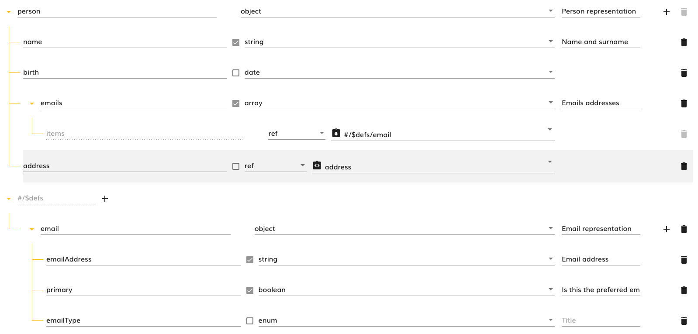
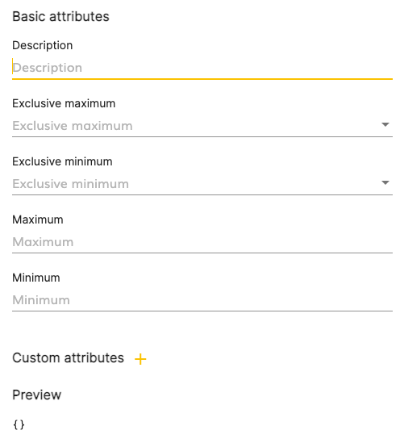
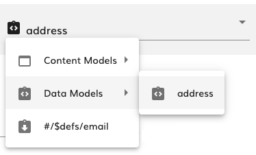
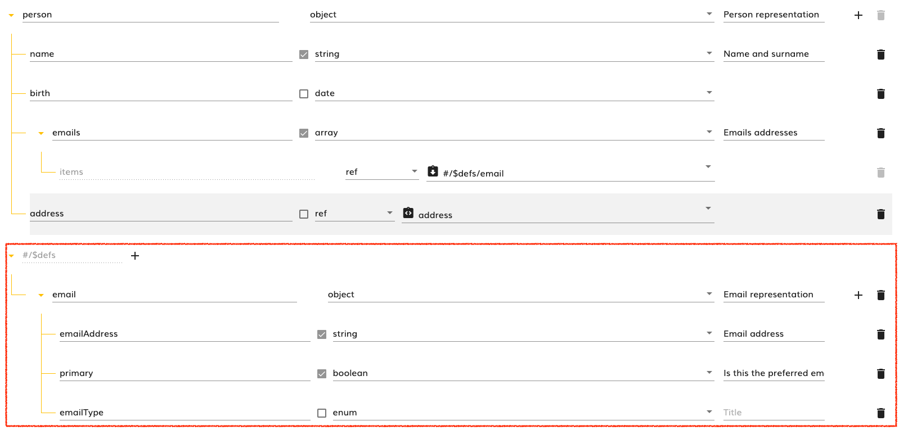
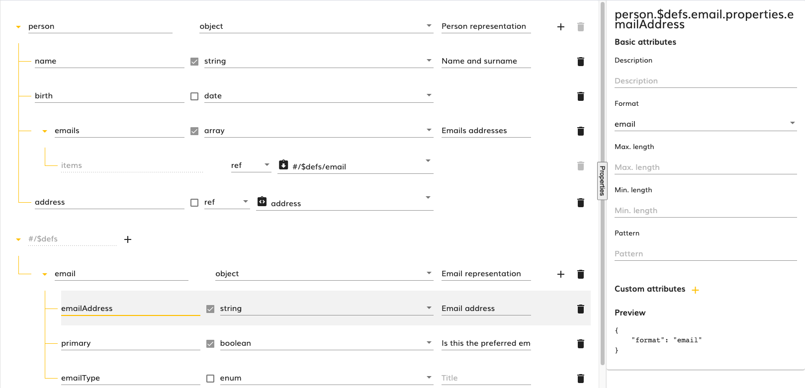
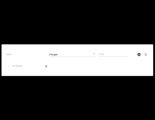

# JSON Schema Editor

- [Intro](#intro)
- [Components](#components)
- [Using the JSON Schema Editor](#using-the-json-schema-editor)
  * [Properties](#properties)
  * [Events](#events)
- [Customizing the JSON Schema Editor](#customizing-the-json-schema-editor)
  * [The `JsonNodeCustomization` class](#the--jsonnodecustomization--class)
- [Editing a JSON schema node properties](#editing-a-json-schema-node-properties)
  * [Properties](#properties-1)
  * [Events](#events-1)

## Intro

In the modeling application we use JSON schema to define the data structure of the variables managed in the different kind of models. This allows the modeling application to display proper user inputs when prompting the user to set a variable value and also, helps the [expression editor](../expression-code-editor/README.md) to suggest autocompletion when writing an expression based on the context variables.

The JSON schema editor allows the user to visually create JSON schemas, and it can be customized in order to restrict its options to the use case needs (for example we can decide whether we want to allow a property to have more than one type, or we can disable schema composition,...).

## Components

There are 4 components under this section that are related  between them:

1. [modelingsdk-json-schema-editor](../components/json-schema-editor/json-schema-editor.component.ts): It provides an [editable](#using-the-json-schema-editor) and [customizable](#customizing-the-json-schema-editor) JSON schema view where you can create nodes. It represents a JSON schema node and recursively nests the children nodes to the given one.

> 

2. [modelingsdk-json-schema-editor-dialog](../components/json-schema-editor-dialog/json-schema-editor-dialog.component.ts): It is the same as the previous component but opened inside a material modal dialog.

3. [modelingsdk-json-schema-node-settings](../components/json-schema-node-settings/json-schema-node-settings.component.ts): It displays a JSON schema [node settings editor](#editing-a-json-schema-node-properties) where some attributes can be applied to the selected node.

> 

4. [modelingsdk-property-type-selector-smart](../components//reference-selector/reference-selector.component.ts): It displays a hierarchical selector for referencing other json schemas available. The schemas are grouped so they can be easily found under certain category.

> 

## Using the JSON Schema Editor

In order to use the JSON Schema editor, we need to include make use of the `modelingsdk-json-schema-editor` component (or the `modelingsdk-json-schema-editor-dialog` if we want to embed it inside a modal dialog). It implements the `ControlValueAccessor` so you can use it with double binding via `[(ngModel)]`.

```html
<modelingsdk-json-schema-editor
    [(ngModel)]="schema"
    (changes)="onContentChanges($event)"
    (selected)="onNodeSelected($event)"
    >
</modelingsdk-json-schema-editor>
```

### Properties

> Mind that the JSON schema editor uses the `modelingsdk-json-schema-editor` **recursively** to display the current node and its children, so many of its properties are useless when creating a JSON schema editor and only make sense when creating the recurring children

| Name | Type | Default value | Description |
| ---- | ---- | ------------- | ----------- |
| value | [`JSONSchemaInfoBasics`](../../../api/types.ts#660) | `{}` | The JSON schema corresponding to the current node. |
| <a name="enableSettingsDialog" id="enableSettingsDialog"></a>enableSettingsDialog | `boolean` | `true` | Whether the current node will display a gear button that opens the  `modelingsdk-json-schema-node-settings`. [More information here](#settingsDialog) |
| <a name="allowInLineDefinitions" id="allowInLineDefinitions"></a>allowInLineDefinitions | `boolean` | `true` | Whether the `#/$defs` block for creating definitions in the current schema is displayed or not. It only makes sense when [depth](#depth) is `0`  |
| allowCustomAttributes | `boolean` | `true` | Whether the custom attributes section in the `modelingsdk-json-schema-node-settings` dialog will be displayed or not. It only makes sense to use it when [enableSettingsDialog](#enableSettingsDialog) is `true` |
| allowAttributesPreview | `boolean` | `true` | Whether the custom attributes preview section in the `modelingsdk-json-schema-node-settings` dialog will be displayed or not. It only makes sense to use it when [enableSettingsDialog](#enableSettingsDialog) is `true` |
| <a name="dataModelType" id="dataModelType"></a>dataModelType | `string` | `undefined` | We can use this field to set a data model type that provides customization for the JSON schema editor. See [customization](#customizing-the-json-schema-editor) later|
| key | `string` | `root` | The name for the current node. |
| <a name="depth" id="depth"></a>depth | `integer` | `0` | The depth in the parent schema (this is used only for recursion) |
| blockedNode | `boolean` | `false` | Whether the current node is blocked for edition or not |
| required | `boolean` | `false` | Whether the current node is required in the parent schema or not  (this is used only for recursion) |
| lastChild | `boolean` | `false` | Whether the current node is the last node in the parent schema (this is used only for recursion and in order to display CSS classes properly) |
| enableKeyEdition | `boolean` | `false` | Whether the current node name edition is enabled |
| displayRequired | `boolean` | `true` | Whether to display the required checkbox in the current node (this is used only for recursion) |
| filteredReferences | `string[]` | `[]` | Array of references that will be removed from the [reference selector](../components//reference-selector/reference-selector.component.ts) |
| hierarchy | `Observable<`[`PropertyTypeItem`](../../properties-viewer/property-type-item/models.ts#20)`[]>` | `undefined` | This is an observable of the object containing all the available references in the schema and that will be displayed in the [reference selector](../components//reference-selector/reference-selector.component.ts) (this is used only for recursion and for performance improvement) |
| compositionIndex | `integer` | `-1` | The order in the array when the node belongs to a composition such as `allOf`, `anyOf`,... (this is used only for recursion) |
| accessor | `any[]` | `undefined` | The accessor in the root schema for the current node  (this is used only for recursion) |
| nodeSelectedAccessor | `any[]` | `false` | The accessor of the node selected in the [root schema](#rootSchema) (this is used only for recursion and in order to display CSS classes properly) |
| <a name="rootSchema" id="rootSchema"></a>schema | [`JSONSchemaInfoBasics`](../../../api/types.ts#660) | The schema for the node with [`depth`](#depth)`=0` | The whole JSON schema to which the JSON schema nodes belong. It is not necessary to be set as in the node with [`depth`](#depth)`=0` it will pass it to the children nodes (this is used only for recursion) |

### Events

| Name | Type | Description |
| ---- | ---- | ----------- |
| changes | [`EventEmitter`](https://angular.io/api/core/EventEmitter)`<`[`JSONSchemaInfoBasics`](../../../api/types.ts#660)`>` | Emitted when the current node schema changes (it pops up from the children node to the root node). |
| nameChanges | [`EventEmitter`](https://angular.io/api/core/EventEmitter)`<{ oldName: string; newName: string }>` | Emitted when the value of the name (key) of the current node changes. |
| selected | [`EventEmitter`](https://angular.io/api/core/EventEmitter)`<any[]>` | Emitted when the value of the selected node in the schema changes. The value emitted is the accessor of the selected node referencing the [root schema](#rootSchema) |
| propertyDeleted | [`EventEmitter`](https://angular.io/api/core/EventEmitter)`<string>` | Emits the name of a property that has been deleted from the current node (this is used only for recursion). |
| childrenDeleted | [`EventEmitter`](https://angular.io/api/core/EventEmitter)`<`[`ChildrenDeletedEvent`](../models/model.ts#120)`>` | Emits the composition type and index of a children that has been deleted from the current node (this is used only for recursion). |
| requiredChanges | [`EventEmitter`](https://angular.io/api/core/EventEmitter)`<{ key: string; value: boolean }>` | Emitted when the value of the required checkbox of one of the children of the current node changes (this is used only for recursion). |

## Customizing the JSON Schema Editor

The JSON Schema Editor is a way of creating Data Structures following the JSON Schema standard and initially its interface was created to allow the user to use its whole potential, but there can be use cases where we want to restrict the user the JSON schemas that can be created (for example don't allow the user to select more than one type for a property) or maybe we want to change some labels so they are closer to the business domain than the JSON schema domain.

The JSON Schema editor can receive a [data model type](dataModelType) parameter with a key and that key refers to a customizer injected in the application by using the `DATA_MODEL_CUSTOMIZATION` injection token defined [here](../services/data-model-customization.ts#31) that should implement the abstract class [DataModelCustomizer](../services/data-model-customization.ts#33).

> :warning: **NOTE**: If no [data model type](dataModelType) is provided or if the one provided has no customizer registered with that name, then, the [default customizer](../services/default-data-model.customization.service.ts) is used, and this customizer uses the default modeling configuration (such as referencing date primitives, files and folders) and uses the JSON Schema domain concepts.

For example, if we have the `MyBusinessDataModelCustomizer` class extending the [DataModelCustomizer](../services/data-model-customization.ts#33) abstract class, we can register it inside a module like this:

```typescript
@NgModule({
    imports: [
        ...,
        VariablesModule
    ],
    providers: [
        ...,
        provideDataModelCustomization(MyBusinessDataModelCustomizer)
    ]
})
export class MyBusinessExampleModule { }

```

The customization for a JSON schema node can be done by extending the following method of the [DataModelCustomizer](../services/data-model-customization.ts#33) abstract class:

| Method | Description |
| ------ | ----------- |
| `abstract getDataModelType(): string` | **Required** The name of the customizer that matches the [data model type](dataModelType)|
| `getTypes(schema: JSONSchemaInfoBasics, accessor: string[]): string[]` | Return an array of types identifiers that are available for the node referenced by the `accessor` in the provided `schema` |
| `setType(type: string, schema: JSONSchemaInfoBasics, accessor: string[], added: boolean)` | Sets (`added=true`) or removes (`added=false`) the type identified by the `type` string in the node referenced by the `accessor` in the provided `schema` |
| `updateNodeCustomization(schema: JSONSchemaInfoBasics, accessor: string[], customization: JsonNodeCustomization)` | Modifies the [JsonNodeCustomization](#the-jsonnodecustomization-class) object with the proper customizations needed for the node referenced by the `accessor` in the provided `schema` |
| `getPropertiesDefinitionForType(schema: JSONSchemaInfoBasics, accessor: string[], type: string): JSONTypePropertiesDefinition` | Returns the properties that are applicable to the node referenced by the `accessor` in the provided `schema` as a [JSONTypePropertiesDefinition](../models/model.ts#107). It is nothing but a list of key-[input](../../properties-viewer/value-type-inputs/doc/README.md) for the node |
| `getProtectedAttributesByType(schema: JSONSchemaInfoBasics, accessor: string[], type: string): string[]` | Returns a list of strings with the name of the properties that are protected to the node referenced by the `accessor` in the provided `schema` so they are not displayed in the node preview section of the `modelingsdk-json-schema-node-settings` component |
| `addProperty(schema: JSONSchemaInfoBasics, accessor: string[]): JSONSchemaInfoBasics` | The JSON schema to be added to a new property created in the node referenced by the `accessor` in the provided `schema` |
| `addItem(schema: JSONSchemaInfoBasics, accessor: string[]): JSONSchemaInfoBasics` | The JSON schema to be added to the `items` attribute setting the node referenced by the `accessor` in the provided `schema` as an array |
| `addDefinition(schema: JSONSchemaInfoBasics, accessor: string[]): JSONSchemaInfoBasics` | The JSON schema to be added when creating a new definition in the [definitions](#allowInLineDefinitions) section when the node selected is the node referenced by the `accessor` in the provided `schema` |
| `addChild(schema: JSONSchemaInfoBasics, accessor: string[], type: string): JSONSchemaInfoBasics` | The JSON schema to be added to a new composition children (`allOf`, `anyOf`,...) from type `type` in the node referenced by the `accessor` in the provided `schema` |

### The `JsonNodeCustomization` class

In the [JsonNodeCustomization](../models/model.ts#125) class we can define for the node some customizations:

| Customization | Options | Type |  Description |
| ------------- | ------- | ---- | ----------- |
| **key** | | | In this block it is possible to customize the name of the JSON schema node |
| | disabled | `boolean` | Whether the input for the name of the JSON schema node is disabled or not |
| | hide | `boolean` | Whether the input for the name of the JSON schema node is hidden or not |
| | value | `string` | A label to be displayed as name in the JSON schema node overriding the current name |
| **required** | | | In this block it is possible to customize the required checkbox of the JSON schema node |
| | disabled | `boolean` | Whether the required checkbox of the JSON schema node is disabled or not |
| | hide | `boolean` | Whether the required checkbox of the JSON schema node is hidden or not |
| | value | `boolean` | A boolean value to be set in the required checkbox of the JSON schema node overriding the current required value |
| **type** | | | This block customises the type input of the JSON Schema node  |
| | disabled | `boolean` | Whether the input for the type of the JSON schema node is disabled or not |
| | hide | `boolean` | Whether the input for the type of the JSON schema node is hidden or not |
| | value | `string[]` | A string array with the identifiers of the types to be set in the type input of the JSON schema node overriding the current type value |
| | definitions | [`JSONSchemaTypeDropdownDefinition`](../models/model.ts#70) | An object containing the material select options to be displayed in the type input. It can be single or multiple, it can use groups or be plain. For each option a label and an id must be provided. See [JSONSchemaTypeDropdownDefinition](../models/model.ts#70) |
| | references | `{ whiteList?: string[]; blackList?: string[]; }`| References to be filtered in the [reference selector](../components//reference-selector/reference-selector.component.ts). The filter can be provided by using the white-list or black-list policy |
| **title** | | | In this block it is possible to customize the title of the JSON schema node |
| | disabled | `boolean` | Whether the input for the title of the JSON schema node is disabled or not |
| | hide | `boolean` | Whether the title for the name of the JSON schema node is hidden or not |
| | value | `string` | A value to be displayed as title in the JSON schema node overriding the current title |
| **buttonTooltips** | | | Here we can provide the tooltips for the different buttons available in the JSON schema editor|
| |anyOf| `string` | The tooltip for the button for adding a child to the `anyOf` composition |
| |allOf| `string` | The tooltip for the button for adding a child to the `allOf` composition |
| |oneOf| `string` | The tooltip for the button for adding a child to the `oneOf` composition |
| |property| `string` | The tooltip for the button for adding a property to the JSON schema node |
| |definition| `string` | The tooltip for the button for adding a new [inline definition](#allowInLineDefinitions) in the JSON schema editor |

## Editing a JSON schema node properties

For editing a JSON schema node properties, we can use the `modelingsdk-json-schema-node-settings` as a separate component that receives the selected node event from the `modelingsdk-json-schema-editor`.

> 

For example:

```html
<modelingsdk-json-schema-node-settings
    [value]="nodeSelected"
    [schema]="schema"
    [accessor]="nodeSelectedAccessor"
    (changed)="onSelectedNodeChanged()"
    >
</modelingsdk-json-schema-node-settings>
```

<a name="settingsDialog" id="settingsDialog"></a>Or we can set the [enableSettingsDialog](#enableSettingsDialog) to `true` input to display a gear button in the JSON schema nodes that, when clicked, will open a modal dialog containing the `modelingsdk-json-schema-node-settings` for the selected node.

> 

### Properties

| Name | Type | Default value | Description |
| ---- | ---- | ------------- | ----------- |
| value | [`JSONSchemaInfoBasics`](../../../api/types.ts#660) | `{}` | The JSON schema corresponding to the JSON schema node which properties are edited. |
| allowCustomAttributes | `boolean` | `true` | Whether the custom attributes section will be displayed or not. |
| allowAttributesPreview | `boolean` | `true` | Whether the custom attributes preview section will be displayed or not. |
| dataModelType | `string` | `undefined` | We can use this field to set a [data model type](#dataModelType) that provides customization for the JSON schema editor. See [customization]. |
| schema | [`JSONSchemaInfoBasics`](../../../api/types.ts#660) | `undefined` | The root schema which the node being edited belongs to |
| accessor | `any[]` | `undefined` | The accessor in the root schema for the node being edited. |

### Events

| Name | Type | Description |
| ---- | ---- | ----------- |
| changed | [`EventEmitter`](https://angular.io/api/core/EventEmitter)`<`[`JSONSchemaInfoBasics`](../../../api/types.ts#660)`>` | Emits the current node schema when it changes. |
