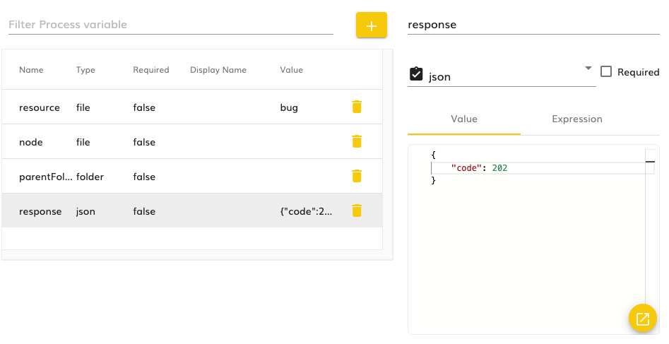

# Variables definition

- [Intro](#intro)
- [The `modelingsdk-properties-viewer` component](#the-modelingsdk-properties-viewer-component)

## Intro

The variables definition is used in the Modeling Application whenever we need to set variables for a model, like for example in processes.

## The `modelingsdk-properties-viewer` component

This is the component used for defining the variables of a model in the Modeling Application.

It consists of two columns where:

* In the left column we have a table containing all the variables defined for the model where we can see the name of the variable, its [primitive type](../../../helpers/primitive-types.ts), and its default value (if set). It is also displayed an input in order to filter the variables displayed in the table (so it only displays the variables that contain the input string in their names), and a plus button for adding a new variable.
* The right column is empty by default until the user selects one variable from the list or adds a new one. In that moment the information of the variable is displayed and it consists of:
  * Variable name: The name of the variable that can only contains letters (no matter the case) and numbers
  * Variable type: A selector using the [`ama-property-type-selector` component](../property-type-selector/property-type-selector.smart-component.ts) that displays the available types in the project in a hierarchical way.
  * A check to set whether the variable is a required one for the model, meaning that it must be set before executing the model.
  * Variable default value: Once the variable type is selected, then we can set the default value based on a static value or an expression
    * Value: An input to set the default value is displayed. To determine which input needs to be displayed, it uses the [`modelingsdk-value-type-input`](../value-type-input.component.ts) setting its type to the type selected before. See more information about the Modeling SDK inputs [here](../value-type-inputs/doc/README.md)
    * Expression: It renders the [Expression Editor](../../expression-code-editor/doc/README.md) and sets the context for building the condition to all the variables defined for this model.

>
