# Modeling SDK Inputs 

- [Intro](#intro)
- [The generic `modelingsdk-value-type-input` component](#the-generic-modelingsdk-value-type-input-component)
  * [Properties](#properties)
  * [Events](#events)
- [Creating a custom input](#creating-a-custom-input)
- [Registering the custom input](#registering-the-custom-input)
- [Out of the box inputs provided by the Modeling SDK](#out-of-the-box-inputs-provided-by-the-modeling-sdk)
  * [string](#string)
  * [integer](#integer)
  * [boolean](#boolean)
  * [date](#date)
  * [datetime](#datetime)
  * [json](#json)
  * [file](#file)
  * [folder](#folder)
  * [array](#array)
  * [enum](#enum)

## Intro

The Modeling Application allows the developers to register custom inputs that render the appropriate component to be displayed when prompting certain data to the user. These inputs are used mainly (but not exclusively) for setting a variable value or a parameter (for example the input of a connector action).

In this document, we will describe how to implement a new custom input, how to register it for the Modeling Application to use it, which are the inputs for [Primitive Types](../../../../helpers/primitive-types.ts) that are already exist, focusing on how a JSON schema model can be received and used.

## The generic `modelingsdk-value-type-input` component

Whenever we want to display an input which type will be defined at execution time (because for example, it depends on the context) we can use the [`modelingsdk-value-type-input` component](../../value-type-input.component.ts) and receive the type as a parameter.

The [`modelingsdk-value-type-input` component](../../value-type-input.component.ts) implements the `ControlValueAccessor` so we can use the double binding via `[(ngModel)]` to set and modify the value of the input.

We say that the [`modelingsdk-value-type-input` component](../../value-type-input.component.ts) is generic because it will render the component registered in the Modeling Application for the `type` parameter received by using the component factory. How this is done in the component is highlighted in the following text code extracted from the component:

```typescript
Component({
    template: '<template #valueTypeInput></template>',
    ...
})

export class ValueTypeInputComponent implements OnDestroy, OnChanges, ControlValueAccessor {
    ...
    @Input() type: string;
    ...
    @ViewChild('valueTypeInput', { read: ViewContainerRef, static: true }) valueTypeInput;
    valueTypeInputRef: ComponentRef<any>;
    ...
    constructor(private resolver: ComponentFactoryResolver,
                @Inject(INPUT_TYPE_ITEM_HANDLER) private inputTypeItemHandler: InputTypeItem[]) { }
    ...
    ngOnChanges(changes: SimpleChanges): void {
        ...
        if (changes.type) {
            ...
            const factory: ComponentFactory<any> = this.resolver.resolveComponentFactory(this.getInputItemImplementationClass(this.type));
            this.valueTypeInputRef = this.valueTypeInput.createComponent(factory);
            ...
        }
        ...
    }
    
    private getInputItemImplementationClass(type: string): Type<any> {
        for (const handler of this.inputTypeItemHandler) {
            if (handler.type === type) {
                return handler.implementationClass;
            }
        }
        return this.getDefaultImplementationClass();
    }
    ...
}
```

As we can see, the injection token `INPUT_TYPE_ITEM_HANDLER` will store all the available components in the application along with the type and this is how the concrete input can be resolved at execution time. See later [how to register a custom input](#registering-the-custom-input) for reference.

### Properties

The [`modelingsdk-value-type-input` component](../../value-type-input.component.ts) also receives the common input parameters (disabled, required, placeholder,...). A summary of the properties that can receive can be displayed in the following table:

| Name | Type | Default value | Description |
| ---- | ---- | ------------- | ----------- |
|value|`any`|`null`|The value for the input|
|index|`number`|`undefined`|The index of the input in a loop. It is useful when using `trackBy` functions|
|type|`string`|`undefined`|The type of the input that will be used to resolve the registered component for that type|
|step|`number`|`undefined`|This parameter is used in number inputs when the browser renders an up and down button to increase or decrease the value. The step tells the browser how much the value of the input must be increased or decreased when clicking on the up or down button respectively|
|options|`any`|`null`|This parameter was intended to receive the options of inputs from select type|
|disabled|`boolean`|`false`|Whether the input should be disabled for editing or not|
|extendedProperties|`any`|`null`|This parameter is intended to receive any further configuration needed for the component to be rendered|
|required|`boolean`|`false`|Whether the input is required or not|
|placeholder|`string`|`undefined`|A string to be displayed in the input when no value has been set yet|
|readonly|`boolean`|`false`|Whether the input must be displayed in readonly mode so no modification can be done|
|model|[`JSONSchemaInfoBasics`](../../../../api/types.ts#660)|`undefined`|The JSON schema model of the input. This can be used for example to render a full form based on the properties described in the JSON schema or to retrieve validations described there such as minimum length, pattern, ... You can get more information about using JSON Schemas in the Modeling Application [here](../../../../services/doc/working-with-json-schemas.md)|
|autocompletionContext|[`ElementVariable`](../../../../api/types.ts#720)`[]`|`[]`|This is a context where the input is going to be used. It is useful when the component to be rendered needs the context, for example, because that component going to use the [Expression Editor](../../../expression-code-editor/doc/README.md) to build an expression|

### Events

| Name | Type | Description |
| ---- | ---- | ----------- |
|onChange|[`EventEmitter`](https://angular.io/api/core/EventEmitter)`<any>`|Emmits the new value set in the input component whenever it changes|
|advancedOutputs|[`EventEmitter`](https://angular.io/api/core/EventEmitter)`<any>`|Emmits any additional information that the concrete implementation of the input needs to propagate|

## Creating a custom input
 
In the [Working with JSON schemas documentation](../../../../services/doc/working-with-json-schemas.md) we included an example on [how to create a custom input](../../../../services/doc/working-with-json-schemas.md#registering-a-primitive-type-and-an-input-for-it) in the Modeling Application for the type `floating-point`.

```typescript
@Component({
    template: `
    <mat-form-field floatLabel="never">
        <input
            matInput
            type="number"
            [step]="step"
            [placeholder]="(placeholder ? placeholder : 'SDK.VALUE') | translate"
            [modelingsdk-allowed-characters]="regexInput"
            data-automation-id="variable-value"
            [formControl]="validatedInput"
            [errorStateMatcher]="matcher"
        />
         <mat-hint modelingsdk-input-error class="mat-error"></mat-hint>
    </mat-form-field>
    `
})
export class PropertiesViewerFloatingPointInputComponent extends PropertiesViewerModelValidatedInputComponent {

    @Input() step: number = null;
    regexInput = /^[+-]?\d+(\.\d+)?$/;

    constructor(variablesService: VariablesService) {
        super(variablesService);
    }

    protected computeModel() {
        if (this.model?.multipleOf) {
            this.step = this.model.multipleOf;
        }
    }

    protected transformValueToBeEmitted(value: any) {
        const inputValue = parseFloat(value);
        return isNaN(inputValue) ? null : inputValue;
    }
}
```

For creating this input we have extended the [`PropertiesViewerModelValidatedInputComponent` component](../../model-validated-input.component.ts) that is an abstract component that is able to display errors messages from validators created from the JSON schema model like for example the minimum value, the maximum value,...

You can create any component you want for your concrete purposes, the only thing you need to keep in mind is that the inputs of your component are those [described before](#properties) so any further configuration can be stored in the `extendedProperties` input.

## Registering the custom input

Once we have the component created for our new input, is time to register it in the [`INPUT_TYPE_ITEM_HANDLER` injection token](../value-type-inputs.ts#22) so it can be resolved by the [`modelingsdk-value-type-input` component](#the-generic-modelingsdk-value-type-input-component).

To do so, the [`provideInputTypeItemHandler` function](../value-type-inputs.ts#31) is provided. Here is a description of the parameters of this function and what they are used for:

|Parameter|Type|Required|Description|
|---------|----|--------|-----------|
|type|`string`|Yes|The name of the type the input is going to be registered for. This name will be used in the [`modelingsdk-value-type-input` component](#the-generic-modelingsdk-value-type-input-component) to render the component described in the `implementationClass`.|
|implementationClass|`Type<any>`|Yes|The class of the component to be rendered when in the [`modelingsdk-value-type-input` component](#the-generic-modelingsdk-value-type-input-component) the value of the `type` property matches the `type` registered here|
|primitiveType|`string`|No|The [primitive type](../../../../helpers/primitive-types.ts) corresponding to this input. For example, we can create an input to get connector names that display a dropdown of all the connectors in the project. The primitive type for this example input would be `string`. This is used for example in the input mapping of a service task when we filter the available variables that match only the type of the connector parameter.|
|model|[`JSONSchemaInfoBasics`](../../../../api/types.ts#660)|No|The JSON schema for the input. It is used for autocompletion purposes so the [Expression Editor](../../../expression-code-editor/doc/README.md) can provide autocompletion and hints when using a variable of this type to build an expression|

To register a new input we need to use the [`provideInputTypeItemHandler` function](../value-type-inputs.ts#31) in the provider's section of a module included in the application. For example, in the example on [how to create a custom input](../../../../services/doc/working-with-json-schemas.md#registering-a-primitive-type-and-an-input-for-it) we did:

```typescript
@NgModule({
    imports: [
        ...,
        VariablesModule
    ],
    providers: [
        ...,
        provideInputTypeItemHandler('floating-point', PropertiesViewerFloatingPointInputComponent, 'json', { title: 'Floating point', type: 'number', multipleOf: 0.01 })
    ],
    ...
})
export class MyBusinessExampleModule { }
```

The [out of the box inputs](#out-of-the-box-inputs-provided-by-the-modeling-sdk) are registered in the [`variables` module](../../../variables.module.ts) like this:

```typescript
@NgModule({
   ...
    providers: [
        ...,
        provideInputTypeItemHandler('string', PropertiesViewerStringInputComponent),
        provideInputTypeItemHandler('integer', PropertiesViewerIntegerInputComponent),
        provideInputTypeItemHandler('boolean', PropertiesViewerBooleanInputComponent),
        provideInputTypeItemHandler('date', PropertiesViewerDateInputComponent),
        provideInputTypeItemHandler('datetime', PropertiesViewerDateTimeInputComponent),
        provideInputTypeItemHandler('json', PropertiesViewerJsonInputComponent),
        provideInputTypeItemHandler('file', PropertiesViewerFileInputComponent),
        provideInputTypeItemHandler('folder', PropertiesViewerFolderInputComponent),
        provideInputTypeItemHandler('array', PropertiesViewerArrayInputComponent),
        provideInputTypeItemHandler('enum', PropertiesViewerEnumInputComponent, 'json'),
        ...
    ],
    ...
})
export class VariablesModule { }

```

## Out of the box inputs provided by the Modeling SDK

In this variables library of the Modeling SDK there are some inputs that have already been defined for the [primitive types](../../../../helpers/primitive-types.ts) and that we will be describing.

### string

The [string input](../string-input/string-input.component.ts) extends the `PropertiesViewerModelValidatedInputComponent` component](../../model-validated-input.component.ts) so it can receive the JSON schema with restrictions over the string length or the pattern to match.

>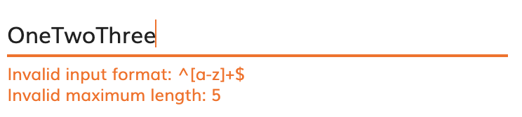

By default it renders a simple text input, but if in the JSON schema it receives the pattern and that pattern allows new lines (`\n`), then instead of the simple string input, it displays a text area.

>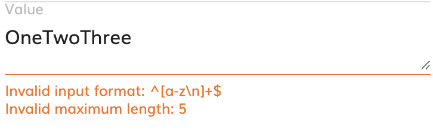

### integer

The [integer input](../integer-input/integer-input.component.ts) extends the `PropertiesViewerModelValidatedInputComponent` component](../../model-validated-input.component.ts) so it can receive the JSON schema with restrictions over the maximum or minimum value.

>

### boolean

The [boolean input](../boolean-input.component.ts) renders a dropdown value with the `true` and `false` options.

>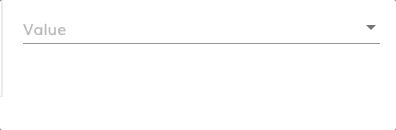

### date

The [date input](../date-input.component.ts) renders a component with a date picker to allow selecting a date easily. 

>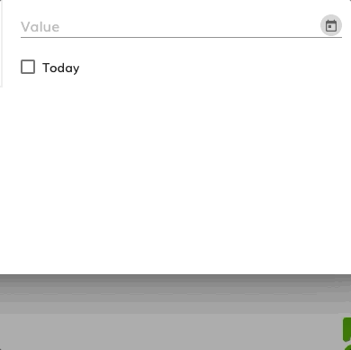

It also provides a `Today` checkbox that when clicked sets the value of the input to the date when the input component is rendered (under the hoods it is setting the value of the input to the `${now()}` expression).

### datetime

The [datetime input](../date-time-input.component.ts) renders a component with a datetime picker to allow selecting a date and time easily. 

>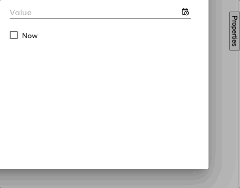

It also provides a `Now` checkbox that when clicked sets the value of the input to the date and time when the input component is rendered (under the hoods it is setting the value of the input to the `${now()}` expression).

### json

The [json input](../json-input/json-input.component.html) allows the user to introduce JSON values. 

If no JSON schema for the JSON to be introduced is provided via `model` property, then a code editor is displayed for the user to introduce whatever data is needed.

>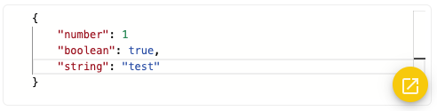

But we can provide the `model` to the input and the json input will create a form from that model placing the appropriate inputs for them based on that data structure. In this case the JSON input will use the [`PropertiesViewerModeledObjectInputComponent` component](../modeled-object/modeled-object-input.component.ts) which is the component responsible of creating the form from the model.

>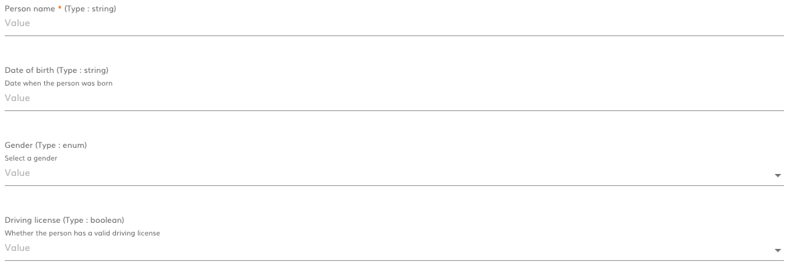

### file

The [file input](../file-input.component.ts) displays a dropdown with the list of available files received in the `extendedProperties` parameter allowing receiving the default selected option also in that parameter.

>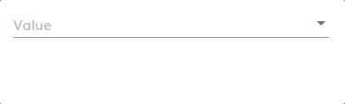

### folder

The [folder input](../folder-input/folder-input.component.ts) only renders a code editor in order to set whatever JSON as value.

>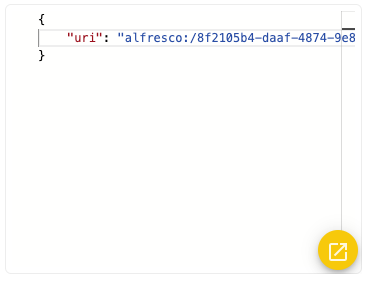

### array

The [array input](../array-input/array-input.component.ts) supports introducing several values for the parameter. 

If the JSON schema is not provided in the `model` property the array is not able to know which is the data structure for each of the items of the array, so it displays a code editor to introduce any value needed.

>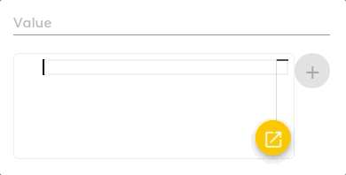

If we provide the JSON schema, then the input to add the item to the array can be adapted to the data structure of the items.

>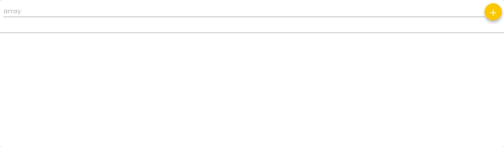

### enum

The [enum input](../enum-input/enum-input.component.ts) renders a select input with the options received in the JSON schema through the `model` property, or from those options received in the `extendedProperties` property.

>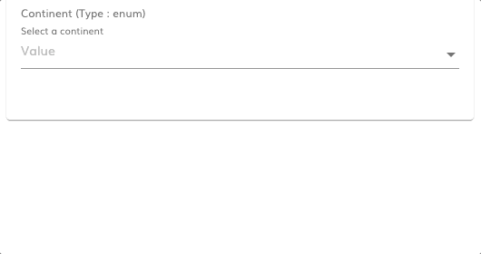
